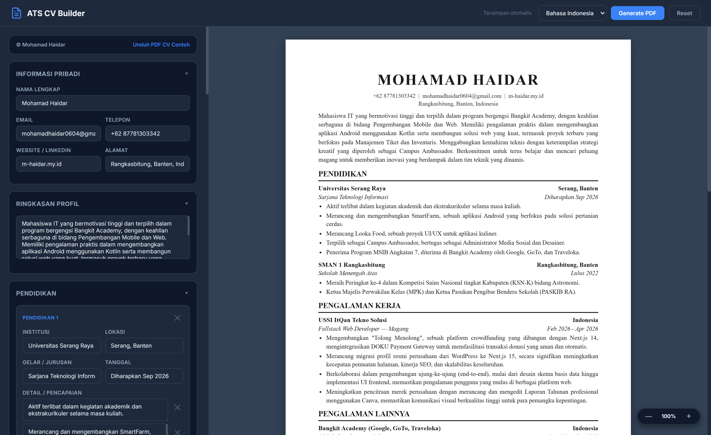

# ATS CV Builder

A modern, fast, and professional ATS-friendly CV/Resume builder that generates perfectly formatted A4 single or multi-page PDFs directly from the browser. Built using zero external dependencies—just clean HTML, Vanilla CSS, and modern JavaScript.



---

## 🌟 Fitur Utama

- **Pratinjau Langsung (Live Preview)**: Form pengisian di sebelah kiri terhubung secara langsung dengan lembar pratinjau A4 di sebelah kanan.
- **Pembagi Halaman Cerdas (Smart Page-Breaking)**: Algoritma JavaScript mengukur tinggi konten secara dinamis dan otomatis membagi baris ke halaman baru untuk mencegah teks terpotong di batas cetak atau judul bagian menggantung (*orphaned headers*).
- **Isolasi Zoom Cetak (Isolated PDF Zoom)**: Dilengkapi kontrol perbesaran (+/-) pratinjau lembar A4 tanpa mengganggu skala cetak PDF akhir (`zoom: 1 !important` pada media cetak).
- **Ramah Seluler (Mobile-Friendly)**: Tampilan seluler yang responsif dengan sistem tab navigasi ("Tulis CV" & "Lihat Preview") dan burger menu collapsible untuk fungsionalitas topbar.
- **Dukungan Dua Bahasa**: Pilihan mengubah tajuk CV (*headers*) instan antara Bahasa Inggris dan Bahasa Indonesia.
- **Penyimpanan Otomatis (Auto-Save)**: Data CV secara otomatis tersimpan ke `localStorage` browser sehingga data pengisian tidak hilang saat halaman dimuat ulang.
- **Reset Bersih (Clean Slate Reset)**: Tombol Reset akan menghapus seluruh data pengisian dan mengosongkan form untuk pembuatan CV baru.

---

## 📂 Struktur Proyek

Proyek ini telah direfaktor untuk pemisahan kode (*separation of concerns*) yang lebih baik:

```
├── index.html   # Struktur markup HTML inti & metadata SEO
├── style.css    # Gaya tata letak (flex/grid), media query responsif, & media cetak A4
└── script.js    # Logika model data default, autosave, rendering form, & algoritma pembagi halaman
```

---

## ⚙️ Cara Menggunakan

1. **Jalankan Aplikasi**: Cukup buka file `index.html` di browser pilihan Anda (Google Chrome, Microsoft Edge, Firefox, atau Safari).
2. **Isi Formulir**: Mulai isi data diri Anda dari "Informasi Pribadi", "Ringkasan Profil", hingga "Keahlian". Anda dapat menambah atau menghapus entri riwayat serta poin detail (*bullets*) secara dinamis.
3. **Atur Skala & Bahasa**: Gunakan tombol zoom di kanan bawah untuk memperbesar pratinjau lembar. Pilih preferensi bahasa tajuk di pojok kanan atas.
4. **Unduh PDF**: Klik tombol **Generate PDF** (atau tekan `Ctrl + P`) -> pilih opsi cetak "Save as PDF" -> pastikan ukuran kertas diatur ke **A4** dengan **Margin: None/Minimum** dan aktifkan opsi **Background graphics** agar pratinjau cetak maksimal.

---

## 🛠️ Detail Implementasi Teknis

### 1. Perhitungan Tinggi Lembar Cetak
Halaman CV diukur dengan dimensi standar kertas A4 internasional (`210mm` x `297mm`). Script menghitung tinggi piksel sebenarnya dari area cetak A4 (tinggi total dikurangi margin padding `18mm` atas dan bawah = `261mm`) secara dinamis menggunakan kontainer off-screen sementara sebelum memindahkan elemen ke lembar pratinjau akhir.

### 2. Centering & Zoom Fleksibel
Untuk mencegah bagian kiri halaman terpotong saat di-zoom, pratinjau menggunakan properti CSS:
```css
.preview-panel {
    display: flex;
    flex-direction: column;
    align-items: safe center; /* Menjaga letak di tengah saat muat, dan align-left jika meluap */
}
.cv-page {
    margin: 0 auto; /* Centering fallback otomatis */
}
```

---

## 👨‍💻 Kontributor & Credit

- **Pengembang**: Mohamad Haidar
- **CV Contoh**: [Unduh Contoh CV PDF](CV-Mohamad Haidar.pdf)
